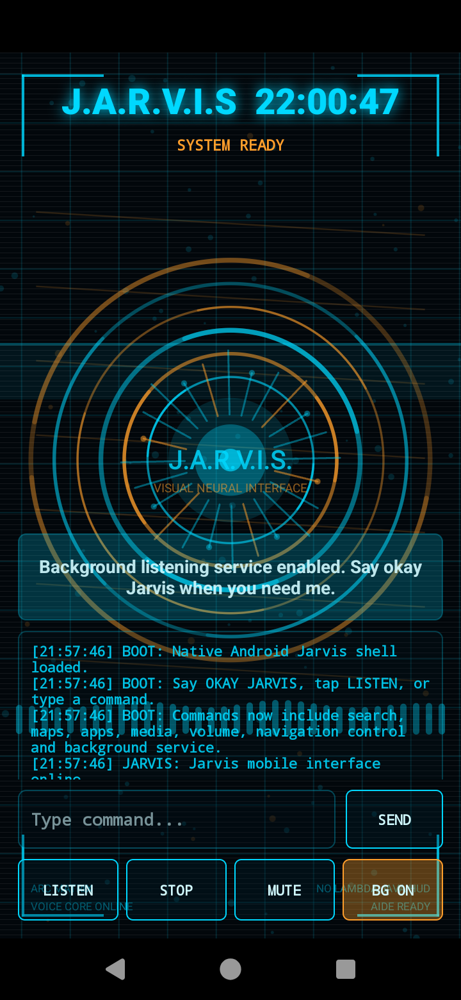

# J.A.R.V.I.S Android Assistant

<p align="center">
  
</p>

---

<p align="center">
  <b>GET API KEY HERE</b><br />
  <a href="https://bazaarlink.ai/">https://bazaarlink.ai/</a><br />
  Then say/type <b>OPEN AI SETTINGS</b> or <b>SETUP AI</b>, copy/import your key from clipboard, verify the key is active, close setup, enjoy.
</p>

<p align="center">
  <b>Other supported AI / Lens API key options</b><br />
  Jarvis supports OpenAI-compatible providers by changing the provider/base URL, API key, and model in AI Setup. Lens/product APIs can be configured with the Lens API commands.
</p>

<div align="center">

| Provider | What it is useful for | Key / setup link | Typical base URL / notes |
|---|---|---|---|
| **BazaarLink AI** | Free/OpenAI-compatible chat and model gateway. Good default for Jarvis. | <a href="https://bazaarlink.ai/">Get BazaarLink key</a> | `https://bazaarlink.ai/api/v1` / try model `auto:free` |
| **OpenAI** | Strong general AI, coding, vision, and image models when you have credits. | <a href="https://platform.openai.com/api-keys">OpenAI API keys</a> | `https://api.openai.com/v1` |
| **OpenRouter** | One key for many model providers through an OpenAI-compatible endpoint. | <a href="https://openrouter.ai/settings/keys">OpenRouter keys</a> | `https://openrouter.ai/api/v1` |
| **Google Gemini / AI Studio** | Gemini models through Google’s OpenAI-compatible endpoint. | <a href="https://aistudio.google.com/app/apikey">Google AI Studio key</a> | `https://generativelanguage.googleapis.com/v1beta/openai/` |
| **Groq** | Very fast OpenAI-compatible chat inference. | <a href="https://console.groq.com/keys">Groq keys</a> | `https://api.groq.com/openai/v1` |
| **Together AI** | OpenAI-compatible models, including chat, vision, image generation, TTS, embeddings. | <a href="https://api.together.ai/settings/api-keys">Together API keys</a> | `https://api.together.xyz/v1` or provider docs URL |
| **Hugging Face Inference Providers** | Unified OpenAI-compatible endpoint for multiple inference providers. | <a href="https://huggingface.co/settings/tokens">Hugging Face tokens</a> | OpenAI-compatible Inference Providers endpoint |
| **SerpApi Google Lens API** | Stronger visual/product matching via structured Google Lens results. | <a href="https://serpapi.com/google-lens-api">SerpApi Lens API</a> | Use with Jarvis Lens API URL/key commands |
| **Apify Google Lens actors** | Google Lens/reverse-image scraping actors with JSON results. | <a href="https://apify.com/api/google-lens-api">Apify Google Lens API</a> | Use with Jarvis Lens API URL/key commands |
| **Pollinations** | No-key fallback for some text/image generation tasks. | <a href="https://pollinations.ai/">Pollinations</a> | Built in as fallback; free endpoints may queue/rate-limit |

</div>

Useful setup commands inside Jarvis:

```text
open AI setup
setup AI
import keys from clipboard
test active key
use first working key
set lens api url https://your-lens-endpoint-here
set lens api key YOUR_KEY
lens api status
clear lens api
```


<p align="center">
  <b>A lightweight Android voice assistant with a cinematic J.A.R.V.I.S-style HUD, wake phrase control, app launching, phone navigation, media controls, search, maps, and background listening.</b>
</p>

<p align="center">
  
  
  
  
  
</p>

---

## Overview

**J.A.R.V.I.S Android Assistant** is a native Android Java assistant designed to feel like a mobile version of a futuristic AI interface. It combines a live animated HUD with voice recognition, Text-To-Speech replies, background listening, app launching, phone controls, Google-style search, YouTube search/music commands, maps navigation, and Accessibility-powered navigation controls.

The project is designed to remain friendly for **AIDE/on-device Android development**:

- Java-only source.
- No lambda expressions.
- No AndroidX requirement.
- No external dependency-heavy setup.
- Programmatic UI/HUD to avoid fragile layout dependencies.

---

## Main Features

### Cinematic J.A.R.V.I.S HUD

- Animated futuristic interface.
- Rotating circular HUD rings.
- Scanning grid background.
- Moving particles and pulse effects.
- Terminal-style command console.
- System status messages.
- Background-service state indicator.
- Voice-core status display.

### Wake Phrase Voice Control

Jarvis can listen for wake phrases such as:

```text
okay Jarvis
ok Jarvis
hey Jarvis
Jarvis
```

Example:

```text
okay Jarvis open YouTube
okay Jarvis play drum and bass on YouTube
okay Jarvis navigate to Tesco
```

### Background Listening Service

- Runs as a foreground service with a persistent notification.
- Allows hands-free use while other apps are open.
- Supports wake phrase activation from the background.
- Includes notification actions for:
  - Pause
  - Resume
  - Stop
- Can restart after reboot if background mode was enabled.
- Will not restart after reboot if the user deliberately paused listening.

### Temporary Listening Pause

To save battery and stop microphone monitoring, say:

```text
okay Jarvis stop listening
okay Jarvis pause listening
okay Jarvis stand down
```

Jarvis pauses microphone monitoring without fully removing the foreground service.

Resume from:

- The Jarvis notification.
- The in-app background button.

### App Launching

Jarvis can open installed apps by name.

Examples:

```text
okay Jarvis open YouTube
okay Jarvis open Chrome
okay Jarvis open WhatsApp
okay Jarvis open Gmail
okay Jarvis open Play Store
okay Jarvis open Maps
okay Jarvis open Camera
okay Jarvis open Calculator
okay Jarvis open Settings
```

It also includes support for common app-name aliases and generic installed-app lookup.

### YouTube Music and Search Commands

Jarvis recognises YouTube commands beyond simply opening the app.

Examples:

```text
okay Jarvis play music on YouTube
okay Jarvis play drum and bass on YouTube
okay Jarvis open YouTube for drum and bass
okay Jarvis search YouTube for 90s hip hop
okay Jarvis YouTube relaxing synthwave
okay Jarvis play music by Adele on YouTube
```

Jarvis opens YouTube directly to the requested search/music query.

### Google-Style Web Search

Examples:

```text
okay Jarvis search for Android development news
okay Jarvis google best restaurants near me
okay Jarvis what is Vulkan
okay Jarvis who invented Java
```

Jarvis opens a web search for the requested query.

### Maps and Navigation

Examples:

```text
okay Jarvis navigate to Tesco
okay Jarvis directions to Manchester Piccadilly
okay Jarvis take me to London
okay Jarvis find petrol station near me
```

Jarvis opens Maps/navigation with the requested destination or search.

### Phone Settings Shortcuts

Examples:

```text
okay Jarvis open settings
okay Jarvis open Wi-Fi settings
okay Jarvis open Bluetooth settings
okay Jarvis open location settings
okay Jarvis open display settings
okay Jarvis open sound settings
okay Jarvis open app settings
okay Jarvis open accessibility settings
okay Jarvis open overlay permission
```

### Media and Volume Controls

Examples:

```text
okay Jarvis volume up
okay Jarvis volume down
okay Jarvis set volume to 50 percent
okay Jarvis max volume
okay Jarvis mute media
okay Jarvis play music
okay Jarvis pause music
okay Jarvis next track
okay Jarvis previous track
```

### Navigation Button Commands

Using the optional Accessibility service, Jarvis can simulate common Android navigation actions.

Examples:

```text
okay Jarvis homescreen
okay Jarvis go home
okay Jarvis go back
okay Jarvis show open apps
okay Jarvis show recent apps
okay Jarvis close app
okay Jarvis close YouTube
okay Jarvis close Chrome
```

> Android does not allow normal apps to silently force-close other apps. The close command uses the safest available Accessibility behaviour, such as Back/Home-style navigation.

### Conversational Replies

Jarvis can respond more naturally to simple interaction commands.

Examples:

```text
okay Jarvis tell me a joke
okay Jarvis thanks
okay Jarvis thank you
okay Jarvis good morning
okay Jarvis good evening
okay Jarvis how are you
okay Jarvis good job
okay Jarvis sorry
okay Jarvis good night
```

Jarvis includes varied replies so it feels less repetitive.

### Built-In Utility Commands

Examples:

```text
okay Jarvis help
okay Jarvis time
okay Jarvis date
okay Jarvis battery
okay Jarvis status
okay Jarvis clear console
okay Jarvis mute
okay Jarvis unmute
```

### Voice Output

- Uses Android Text-To-Speech.
- Attempts to use a UK English voice.
- Uses a lower pitch and slower speech rate for a more assistant-like tone.
- Attempts to select a male/UK-style TTS voice if one is installed on the phone.

> The exact voice depends on the Text-To-Speech engines and voices installed on the device.

---

## Required Permissions

Jarvis explains these permissions during first launch and when a feature needs them.

### Microphone

Required for voice recognition.

### Display Over Other Apps

Required so background command launching works reliably while Jarvis is not open on screen.

Without this permission, background mode is locked and the background button is greyed out.

### Accessibility Service

Required for navigation-style commands:

```text
go back
homescreen
show open apps
close app
```

The service is listed as:

```text
Jarvis Navigation Control
```

Android does not allow apps to silently enable Accessibility services. The user must enable it manually in Android Settings.

### Boot Completed

Allows Jarvis to restore background service mode after reboot, only if the user previously enabled it.

### Query Installed Apps

Allows Jarvis to find and open installed applications by visible app name on newer Android versions.

---

## Example Commands

```text
okay Jarvis open YouTube
okay Jarvis open YouTube for drum and bass
okay Jarvis play drum and bass on YouTube
okay Jarvis search for Android SDK 35
okay Jarvis navigate to Tesco
okay Jarvis volume up
okay Jarvis set volume to 60 percent
okay Jarvis show open apps
okay Jarvis go back
okay Jarvis homescreen
okay Jarvis tell me a joke
okay Jarvis thanks
okay Jarvis stop listening
```

---

## AIDE Build Notes

This project is intended to be opened directly in AIDE as an Android project.

Recommended project location on Android:

```text
/storage/emulated/0/AppProjects/Jarvis
```

Design goals:

- Keep source Java-only.
- Avoid lambda expressions.
- Avoid AndroidX unless deliberately added later.
- Avoid Gradle features that older AIDE setups may not support.
- Keep compatibility with on-device Android development.

---

## Termux Setup Example

If using a downloaded project ZIP:

```bash
termux-setup-storage

mkdir -p "$HOME/storage/shared/AppProjects"

cp "$HOME/storage/shared/Download/Jarvis.zip" "$HOME/storage/shared/AppProjects/"

cd "$HOME/storage/shared/AppProjects"

rm -rf Jarvis

unzip -o Jarvis.zip
```

Then open this folder in AIDE:

```text
/storage/emulated/0/AppProjects/Jarvis
```

---

## Current Limitations

- Android does not allow a normal app to silently enable overlay or Accessibility permissions.
- Android does not allow a normal app to truly force-close another app like the system task manager can.
- Background microphone listening uses battery, so Jarvis includes a pause/stand down command.
- YouTube first-result auto-clicking is not reliably available without deeper Accessibility automation, so Jarvis opens YouTube search results for the requested query.
- The assistant is a local command engine, not a full cloud AI model by default.

---

## Project Goal

The goal is to build a practical Android-based J.A.R.V.I.S-style mobile assistant that can control common phone actions, open apps, search the web, navigate, control media, and respond conversationally, while staying lightweight enough to compile directly on Android through AIDE.

---

## Disclaimer

This project is a fan-made Android assistant interface inspired by futuristic cinematic AI assistants. It is not affiliated with Marvel, Disney, Iron Man, or any official J.A.R.V.I.S product.

---

## v1.13 Intelligence Expansion

This build adds a larger local assistant layer while staying AIDE-friendly, Java-only, no lambdas, no AndroidX, and no external app dependencies.

### New commands

```text
okay Jarvis weather in London
okay Jarvis remind me to check the oven in 10 minutes
okay Jarvis set alarm for 7:30
okay Jarvis show reminders
okay Jarvis remember that my favourite colour is blue
okay Jarvis what do you remember
okay Jarvis fact check the Moon orbits the Earth
okay Jarvis set ai key YOUR_API_KEY
okay Jarvis set ai model gpt-4o-mini
okay Jarvis ask AI explain Android services
okay Jarvis camera vision
okay Jarvis recognise face
okay Jarvis remember face as Jacob
```

### Added features

- Local personal fact memory using SharedPreferences.
- Public fact-check workflow using a Wikipedia source lookup, with Google fallback for manual verification.
- Weather by place using Open-Meteo, no API key required.
- Local alarms and reminders using Android AlarmManager and notifications.
- Expanded media/music control.
- Optional OpenAI-compatible chat endpoint integration through a locally stored API key.
- Camera vision activity for face detection and scene/colour analysis.
- Lightweight local face enrolment and recognition prototype using Android's built-in FaceDetector and simple image signatures.

### Notes

Camera vision and face recognition are deliberately local and dependency-free. This means they are lightweight and AIDE-compatible, but they are not as accurate as a full ML Kit, TensorFlow Lite, or cloud vision model.


## Local AI Key Vault

Jarvis supports Chat AI through a locally stored OpenAI-compatible API key. For safety, API keys are **not hardcoded** into the APK or repository. Add keys on-device instead:

```text
set ai key YOUR_API_KEY
add ai key YOUR_API_KEY
import ai keys from clipboard
ai key status
use ai key 2
clear ai keys
```

The app masks key commands in the console and only shows the last four characters of the active key in status output.


## v15 AI Setup & Local Key Vault

Jarvis now includes an on-device AI setup screen so API keys can be imported locally without committing them to GitHub or embedding them in the APK source.

Commands:

```text
okay Jarvis open AI setup
okay Jarvis import AI keys from clipboard
okay Jarvis append AI keys from clipboard
okay Jarvis test AI connection
okay Jarvis use working AI key
okay Jarvis are AI keys saved
okay Jarvis AI key status
okay Jarvis clear AI keys
```

Keys are stored in Jarvis app data and should survive normal app restarts, phone restarts, and APK updates. They are removed if Jarvis is uninstalled, app data is cleared, the package name changes, or `clear AI keys` is used.


## v18 Vision Upgrade

Jarvis now includes an upgraded AIDE-friendly vision layer:

- Advanced local facial recognition using a 128-value face embedding rather than the original simple colour histogram prototype.
- Multiple face samples can be enrolled for the same person for stronger matching.
- Face status and clearing commands:
  - `okay Jarvis known faces`
  - `okay Jarvis facial recognition status`
  - `okay Jarvis clear face memory`
- Product and visual search commands:
  - `okay Jarvis what is this`
  - `okay Jarvis what product is this`
  - `okay Jarvis identify this product`
  - `okay Jarvis product search`
  - `okay Jarvis open Google Lens`
- QR and barcode scanning commands:
  - `okay Jarvis scan QR code`
  - `okay Jarvis scan barcode`
  - `okay Jarvis read QR code`

The build remains Java-only, AIDE-compatible, no lambdas, no AndroidX, and no bundled external ML dependencies. For exact product matching and QR/barcode decoding, Jarvis will use Google Lens or a ZXing-compatible scanner app when installed.


## v20 Joke Engine Upgrade

Jarvis now includes a larger local joke bank and remembers the last joke it told, so commands like `okay Jarvis tell me a joke`, `another joke`, and `make me laugh` rotate through different responses instead of repeating the same line over and over.


### YouTube launch priority

Jarvis now opens YouTube using this order:

1. Official YouTube: `com.google.android.youtube`
2. ReVanced YouTube: `app.revanced.android.youtube`
3. Google Play Store / Google search fallback if neither package is installed

Example commands:

```text
okay Jarvis open YouTube
okay Jarvis play drum and bass on YouTube
okay Jarvis open YouTube for Android development
```


### v1.21 YouTube Playback + Song Recognition

New commands:

```text
okay Jarvis play Bohemian Rhapsody on YouTube
okay Jarvis play drum and bass on YouTube
okay Jarvis listen to 90s hip hop on YouTube
okay Jarvis what is this song
okay Jarvis identify this song
okay Jarvis open Shazam
```

Jarvis now tries a media-play-from-search intent first so YouTube/YouTube ReVanced/YouTube Music can play the closest matching result when Android and the installed app support it. If direct playback is not supported on that device, Jarvis falls back to opening the YouTube app search result.

Song recognition uses installed recogniser apps first: Shazam, then SoundHound, then Google/Assistant fallbacks, then the app store if no recogniser is available.

### v22 YouTube first-result playback

Jarvis now handles commands such as:

```text
okay Jarvis play dubstep on YouTube
okay Jarvis play Linkin Park Numb on YouTube
okay Jarvis listen to 90s hip hop on YouTube
```

Instead of only opening the YouTube app, Jarvis attempts to resolve the first matching YouTube video and open that video directly in the official YouTube app, ReVanced, YouTube Music, or the browser as a fallback.

### v1.26 Multi-provider AI keys

Jarvis AI Setup now supports multiple OpenAI-compatible providers:

```text
OpenAI -> https://api.openai.com/v1
BazaarLink -> https://bazaarlink.ai/api/v1
Custom OpenAI-Compatible -> user supplied base URL
```

Supported key-style imports now include common forms such as:

```text
sk-proj-...
sk-...
sk-bl-...
sess-...
key-...
api-...
token-...
bearer-...
```

Voice commands:

```text
okay Jarvis set AI provider BazaarLink
okay Jarvis set AI base URL https://bazaarlink.ai/api/v1
okay Jarvis AI provider status
okay Jarvis test AI connection
```


## Jarvis v27 Direct AI Repair

This repair restores direct AI fallback after the multi-provider patch. Once a key is imported, Jarvis can answer natural prompts without the `ask AI` prefix.

Examples:

```text
okay Jarvis give me the code for a Termux script that lists APKs
okay Jarvis explain this Java error
okay Jarvis write a simple Android XML layout
```

AI Setup includes a model dropdown for `gpt-4o-mini`, `gpt-4.1-mini`, and `gpt-4o`. Code responses are detected from fenced Markdown blocks and shown in a separate code box with a **COPY CODE** button.

## Jarvis v28 Full Answers + Project ZIP Packaging

Jarvis can now ask the configured AI provider for full code/project answers instead of tiny snippets. Project-style requests such as Android Java apps, AIDE projects, game examples, and packaged ZIP requests are routed with a stronger full-project prompt.

Example commands:

```text
okay Jarvis give me a full Android Java checkers game project
okay Jarvis make me a packaged zip for an Android Java checkers game
okay Jarvis create a complete AIDE-compatible Android Java project for a calculator app
```

When the AI answer uses Jarvis file markers, the app writes a ZIP into Android Downloads. The AI supplies project files as text and Jarvis packages those files locally.

```text
JARVIS_PROJECT_ZIP: CheckersGame.zip
JARVIS_FILE: settings.gradle
```gradle
...
```
JARVIS_FILE: app/src/main/java/com/example/checkers/MainActivity.java
```java
...
```
```

Jarvis asks for storage permission when needed. The main code panel also shows the largest returned code block and the Copy Code button copies it to the clipboard.


## Jarvis v29 Save Picker + Clear Code

Project ZIP creation no longer saves automatically to Downloads. Jarvis now asks whether to save the generated project and opens Android's file picker so the user chooses the folder/name. Project-generation answers are packaged rather than shown in the code snippet panel. Specific code/snippet requests still show the **CODE SNIPPET** panel with **COPY CODE**.

New commands:

```text
okay Jarvis clear code snippet
okay Jarvis clear code
okay Jarvis save project zip
```


## Jarvis v30 Router Priority Repair

Project/code generation requests now route to AI before local shortcut commands such as weather. This fixes prompts like:

```text
okay Jarvis give me an AIDE compatible Android Java weather app project
```

Jarvis treats this as an AI project-generation request, not as a local weather forecast command.


## Jarvis v31 Conversation Memory + Snippet Refresh

Jarvis now keeps a short recent conversation memory in local app storage so follow-up requests such as `put it in a zip package`, `make that a full project`, or `change the previous app` can refer back to earlier user requests. The memory is included only as recent context for AI calls and skips obvious API keys/tokens/password text.

Useful commands:

```text
okay Jarvis what was my last request
okay Jarvis what are we talking about
okay Jarvis clear conversation memory
```

New code snippets now visually refresh: Jarvis hides/clears the old code box first, then shows the new snippet so it is obvious that the code changed.


## Jarvis v32 Images + Highlighting

Jarvis now adds syntax highlighting in the code snippet panel and can generate images from prompts such as `generate an image of a black Labrador puppy`. Generated images appear inside Jarvis and can be tapped to save through the Android file picker.


## Jarvis v33 Vision Repair + Product Recognition

- Fixes the `JarvisOnlineBrain.java` brace/compiler issue.
- Fixes the `JarvisAISetupActivity.java` `onImageGenerated(...)` interface issue.
- Adds stronger AI-based vision product recognition using the configured AI key.
- Adds better product fallback heuristics, including a Monster Energy can hint.
- Product camera mode now updates the result with an AI recognition section after the local scan completes.


## Jarvis v34 Image Model Fallback

Image generation now tries several image model names automatically instead of failing immediately when the selected provider rejects `gpt-image-1`. For non-OpenAI-compatible catalogs it tries DALL-E style model IDs first, then OpenAI-prefixed fallbacks, and gives a clearer provider-support message if no image model is accepted.


## Jarvis v35 Free Image Fallback

- Automatic free image-generation fallback added.
- If the current provider rejects the image model or the API key is invalid, Jarvis now tries a no-key fallback image generator automatically.
- This fallback is aimed at keeping commands like `generate an image of a black Labrador puppy` working even when the main provider fails.


## Jarvis v36 Product Vision Repair

- Improves local product/object classification for common items such as over-ear headphones, smartphones/tablets, drink cans and bottles.
- Product Vision now displays a stricter likely object result instead of only generic colour/edge text.
- Google Lens launching now tries to pass the captured bitmap/image to Lens/Google visual search instead of only opening the Google app home page.
- Search Product Web now uses image-search style Google results for product identification.
- AI vision prompt was tightened so it names visible objects directly and avoids abstract descriptions.


## Jarvis v37 Clear Generated Image

Generated images can now be dismissed from the Jarvis UI. The image panel includes a **CLEAR GENERATED IMAGE** button, and these voice/text commands are supported:

```text
okay Jarvis clear generated image
okay Jarvis remove generated image
okay Jarvis hide generated image
```

Clearing removes the displayed image and deletes the pending generated image from local app storage.


## Jarvis v38 Product Vision Fix

- Improved local smartphone/tablet vs headphones detection.
- Product Vision no longer auto-launches generic Google home during capture.
- Lens button now sends the captured image through Lens/visual chooser where possible.
- Product web search now opens a strict Google Images product-identification query.


## Jarvis v39 Product Vision / Visual Search Repair

- Improves black smartphone/tablet detection so a phone is not labelled as unknown or headphones.
- Google Lens/Visual Search now avoids the generic Google app image intent that caused "Unable to open image".
- If real Lens is unavailable, Jarvis opens a strict Google Images product search instead.
- Product search queries now use stronger object/model/brand wording.


## Jarvis v40 Free Image + AI Vision Fallbacks

- Adds a wider collective of no-key image generation fallback endpoints/models after the configured provider fails.
- Adds no-key AI vision fallback for `what is this item` / Product Vision when the configured provider fails or no AI key is active.
- Product Vision now sends the captured image to the configured AI provider first when available, then tries a free AI vision fallback before settling for local hints.


## Jarvis v41 Image Fallback Compile Repair

- Fixes the AIDE compile error in `JarvisOnlineBrain.java` where `URLEncoder.encode(...)` created a checked exception in the free image fallback URL builder.
- Keeps the v40 free image fallback and AI vision fallback behaviour.


## Jarvis v42 Anonymous LLM Fallback

Jarvis now tries anonymous OpenAI-compatible chat fallback providers after the configured provider fails, rate-limits, runs out of usable credit, or has no active key. It tries the configured provider first, then OVHcloud AI Endpoints anonymous models, then Pollinations text fallback models.

## Jarvis v43 / 1.4.3 Image Search Fallback

- Version naming now uses `1.4.3` style rather than `1.43`.
- Added web image result fallback for commands like `okay Jarvis give me an image of a black Labrador puppy`.
- Added follow-up image navigation commands: `another one`, `not that one`, and `give me another one`.
- If AI image generation runs out of credits or the provider rejects the model, Jarvis now falls back to image-search results instead of only reporting failure.

## Jarvis v44 Web Image Display Repair

- Fixes web image fallback so Jarvis tries harder to download actual image bytes instead of speaking/opening a raw URL.
- Adds direct image fallback candidates after Google/Bing scraping, including semantic image services and free image fallback endpoints.
- `another one` / `not that one` cycles through more candidate image sources.
- Error messages no longer read long image URLs aloud when a candidate fails.
- Version name is now `1.4.4`.


## Jarvis v45 Web Image Relevance Repair

Improves `give me an image of ...` by using stricter image candidate sources, better relevance ranking, Wikimedia/DuckDuckGo/Bing/Google candidate scraping, and avoids generic random fallback image services that caused unrelated first images. Version is now 1.4.5.


## Jarvis v46 Image Search Accuracy Repair

Improves `give me an image of ...` and `show me an image of ...` so web-image fallback is much stricter about relevance.

What changed:
- adds stronger query-aware ranking for web image results
- adds structured DuckDuckGo and Wikimedia image candidate parsing
- adds smarter search query variants for things like `Tom and Jerry`, `rhino`, and `labrador puppy`
- filters out off-topic transport/random image matches when the query is clearly about something else
- deduplicates repeated image candidates so `another one` is more likely to show a genuinely different image
- bumps app version to `1.4.6`


## Jarvis v47 Location Image Search Enforcement Repair

Improves web image fallback when you ask for places or countries, for example `show me an image of the Philippines`.

What changed:
- adds direct Wikipedia page-image lookup before looser search scraping
- adds stricter country/location query detection
- boosts country/travel/location matches and penalizes unrelated plants, products, and transport images
- improves search query variants for countries and places
- bumps app version to `1.4.7`


## Jarvis v48 AI Error Display + Speech Control Repair

Fixes noisy AI fallback errors appearing around image requests and improves long output handling.

What changed:
- image search/generation commands are routed before generic AI handling, so `show me an image of ...` should not also trigger a chat AI fallback error
- long AI/provider error output is no longer shortened with ellipses by Jarvis before display
- responses over 30 words are displayed in full on screen/console but are not read out loud automatically
- say `read that out loud` or `read the full output` if you want Jarvis to speak the last long response
- background service also avoids speaking very long responses automatically
- bumps app version to `1.4.8`


## Jarvis v49 AI Fallback Cleanup

Fixes the noisy AI fallback error shown when the configured provider is out of credits and the anonymous free providers are busy.

What changed:
- removes the broken OVH anonymous model-rotation path that was returning non-existent model errors
- keeps Pollinations as a free fallback, but stops hammering it when the queue is full
- adds a direct text fallback attempt before giving up
- replaces huge provider/model error dumps with a useful summary telling the user whether the provider has no credits or the free queue is busy
- keeps long AI answers displayed in full, but avoids treating long error dumps as useful assistant answers
- bumps app version to `1.4.9`


## Jarvis v50 Full Lens Compatibility + Auto Product Vision

Version `1.5.0` improves Product Vision and Google Lens hand-off.

What changed:
- Product Vision now sends every captured product image to AI vision, even when no main AI key is configured, so free fallback vision can still try.
- Product Vision automatically launches Google Lens / visual search after capture.
- Lens hand-off now tries standalone Lens, the newer Lens search package, the Google app Lens implementation, Google Photos, Android image chooser, Lens URI fallbacks, then strict Google Images search.
- Lens image sharing no longer depends on `resolveActivity()` returning a result, because some Android builds incorrectly return null even when Lens can handle the image.
- Local product output is less vague while AI/Lens identification is running.
- Keeps AIDE compatibility and no lambdas.


## Jarvis v52 Vision Activity Compile Repair

Fixes the broken `JarvisVisionActivity.java` source that caused hundreds of AIDE errors such as `Unexpected end of line`, `Missing ;`, `Missing )`, and unquoted `GOOGLE / LENS / VISUAL / SEARCH / PRODUCT` tokens. Product Vision, AI vision fallback, automatic Lens hand-off, Search Product Web, and QR/barcode scanning are kept. Version is now `1.5.2`.


## Jarvis v53 Compile-Safe Vision Bridge

Adds a staged vision pipeline for better item recognition without breaking AIDE compatibility.

What changed:
- Adds `JarvisVisionPipeline` and bridge classes for local vision, optional ML Kit, and future Lens API support.
- Adds reflection-based ML Kit detection so the app still compiles even when ML Kit libraries are not bundled.
- Product Vision now runs the bridge pipeline after capture and updates the screen with the strongest available result.
- Keeps AI vision fallback and Google Lens handoff.
- Version bumped to `1.5.3`.

This patch intentionally does not force ML Kit Gradle dependencies yet. Once this bridge compiles on-device, the next patch can safely add the optional ML Kit dependency route.


## Jarvis v54 Full Resolution Product Vision Repair

Video analysis showed Product Vision was using a low-resolution camera thumbnail, then automatically handing the image to the Google app where it often landed on the Google home screen instead of a useful Lens result.

Fixes:
- captures a full-resolution camera image through a Jarvis content provider
- decodes a scaled high-resolution bitmap for AI/local recognition
- shares content:// image URIs instead of private file:// paths
- stops automatic generic Google-app handoff that was dumping the user onto Google home
- improves Lens handoff reliability through a dedicated Jarvis image provider
- adds stronger local drink-can recognition including Pepsi/Pepsi Max style red/blue/white can cues
- bumps version to 1.5.4


## Jarvis v55 Product Label Recognition Repair

Improves local Product Vision recognition for close-up branded drink cans, especially Pepsi / Pepsi Max-style cans where the full-resolution image includes the user’s hand and the can shape is not a perfect tall rectangle.

Changes:
- relaxes can/bottle shape thresholds for close-up camera captures
- improves red/blue/silver packaging detection
- returns `Pepsi Max / Pepsi drink can` when red/blue Pepsi-style cues are visible
- prevents bad AI fallback responses like “no photo was provided” from replacing the useful local result
- bumps version to `1.5.5`


## Jarvis v56 Full ML Kit Product Vision

Adds actual ML Kit dependencies and a stronger product-recognition pipeline.

Changes:
- bundles ML Kit image labelling, object detection, text recognition/OCR, and barcode scanning dependencies
- ML Kit OCR now tries to read visible packaging text such as IRN-BRU, Pepsi, Coca-Cola, Monster, Red Bull, Sprite, Fanta, and similar brands
- Product Vision now prefers strong ML Kit OCR/barcode hits before weaker generic labels
- adds a real configurable Lens-style API bridge for self-hosted or third-party visual search endpoints
- adds commands to set, check, or clear the Lens API endpoint/key
- keeps local heuristic, AI vision, and Google Lens handoff fallbacks
- bumps version to `1.5.6`


## Jarvis v57 AIDE-Compatible OCR Compile Repair

Fixes the v56 build errors reported in AIDE.

Changes:
- removes direct `com.google.mlkit:*` dependencies because newer ML Kit manifests can include directives that older AIDE/aapt cannot parse
- adds AIDE-compatible Google Mobile Vision OCR dependency: `com.google.android.gms:play-services-vision:20.1.3`
- keeps the reflective vision bridge architecture
- adds Mobile Vision OCR fallback for visible packaging text such as IRN-BRU, Pepsi, Monster, Red Bull, etc.
- fixes invalid Java character literals in `JarvisLensApiBridge.java`
- bumps version to `1.5.7`


## Jarvis v58 Direct Contact Calling

Adds direct contact calling and learned contact matching.

Changes:
- `call mum` / `dial mum` now resolves the contact and uses ACTION_CALL when CALL_PHONE permission is granted.
- If direct-call permission is missing, Jarvis asks for Contacts/Phone permission and falls back to the dialler.
- If the spoken name is ambiguous, Jarvis lists similar phonebook matches and waits for `call option 1`, `option 2`, `first one`, etc.
- Jarvis learns successful calls, so frequently used contacts are boosted for future mispronounced names.
- Adds READ_CONTACTS and CALL_PHONE permissions.
- Version bumped to `1.5.8`.


## Jarvis v59 Contact Manager Compile Repair

Fixes the AIDE compile error in `JarvisContactManager.java` where the new contact calling code called `JarvisOutput.log(...)`, which does not exist in the current Jarvis output interface. The repair now uses `onConsole(...)` for internal call diagnostics and keeps direct contact calling, contact choice follow-ups, and learned contact ranking. Version bumped to `1.5.9`.


## Jarvis v60 SMS Contact Messaging

Adds SMS/contact messaging compatibility alongside direct calling.

Changes:
- `text mum` opens the default SMS app for Mum.
- `send mum a message` defaults to normal text message/SMS if no app is specified.
- `text mum saying hello` opens SMS with the message pre-filled.
- Similar-contact matching now works for texting too.
- Follow-up choices now support `text option 1`, `message option 2`, `option 1`, etc.
- Texting behaviour is learned alongside call behaviour, so frequently used contacts rank higher after repeated use.
- Version bumped to `1.6.0`.

## Jarvis v61 Confirmed Direct SMS Sending

Adds direct SMS sending through Jarvis with a confirmation step.

Examples:
- `text mum saying I am on my way`
- `send mum a message saying I will be there soon`
- `yes` / `yes send it`
- `edit` / `change it to ...`
- `discard`

Jarvis now prepares the SMS, reads/displays the message back, then only sends it after confirmation. It uses Android `SEND_SMS` permission and keeps the learned contact ranking from calls/texts.


## v1.6.3 Image Display Recovery

- Restores the generated-image panel when an AI/free fallback returns a remote image URL or Markdown image link.
- Downloads remote image URLs into Jarvis local cache before displaying them.
- Stops raw image URLs being shown/read out as the main response.
- Adds support for phrases like `generating image of ...` and `give me a generated image of ...`.
